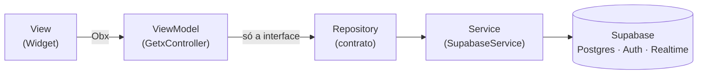

# ADR-001 — MVVM + GetX (e não Clean Architecture)

> **Status:** aceito · **Data:** 2026-08-07 · **Decisor:** Diogo
> **Relaciona:** [[ADR-004-rbac-na-rls]] (a UI não é fronteira de segurança)

## Contexto

O sistema do Espaço Café é pequeno e bem delimitado: **PDV, estoque e relatórios**, com
um único backend (Supabase) e nenhuma regra de negócio complexa no cliente — a parte crítica
mora no Postgres ([[ADR-003-rpc-transacional]]).

O outro projeto Flutter do Diogo, o `englishIA`, usa **Clean Architecture** com quatro camadas
(`core/`, `data/`, `domain/`, `presentation/`) e `usecases`. A tentação natural era repetir.

Só que ali existe motivo: o englishIA tem múltiplas fontes de IA, gateway próprio, RAG, cache
semântico e fallback entre provedores — regras que *precisam* de um lugar neutro. Aqui, um
`RegistrarVendaUseCase` seria uma classe de três linhas repassando a chamada ao Repository.

## Decisão

**MVVM com GetX** para estado, injeção de dependência e rotas.

### As regras que sustentam a decisão

1. View **nunca** chama `Supabase.instance` — só ViewModel → Repository.
2. ViewModel **nunca** importa `supabase_flutter` — só o contrato abstrato.
3. DI por rota via `Bindings` (um por feature), nada de `Get.put` solto no `main`.

A regra 2 é a que dá o retorno concreto: o `PdvViewModel` recebe `ProdutoRepository`,
`VendaRepository` e `ContextoOperacional` — todas interfaces. No teste, entram fakes em memória
e a lógica inteira do caixa roda **sem rede, sem Supabase e sem mock framework**
(`test/fakes/fake_repositories.dart`).

### O caso especial: `ContextoOperacional`

`SessionService` depende de `AuthService`, que depende de `SupabaseService`. Testar o PDV
exigiria subir o SDK inteiro. Extraímos então a interface `ContextoOperacional` com só o que
as ViewModels precisam saber — **qual ministério está em foco** — e o `SessionService` a
implementa. Mesma ideia dos Repositories, aplicada à sessão.

## Alternativas consideradas

| Alternativa | Por que não |
|---|---|
| **Clean Architecture** (como o englishIA) | `usecases` viraria repasse puro. Camada sem regra é custo de manutenção sem contrapartida. |
| **Bloc/Riverpod** | Ferramentas boas, mas o Diogo já opera GetX no englishIA. Trocar de stack num projeto de voluntariado adiciona curva de aprendizado sem ganho. |
| **Estado direto no Widget** | Inviável: PDV, estoque e alertas compartilham o mesmo estado (o badge de alertas aparece em três telas). |

## Consequências

**Positivas**
- Menos código por feature; a distância entre "vou mexer no carrinho" e o arquivo é curta.
- ViewModels testáveis de verdade — 40 testes rodando sem infraestrutura.
- `Bindings` por rota: a ViewModel nasce ao entrar na tela e morre ao sair.

**Negativas / riscos**
- GetX acopla estado, DI e rotas num pacote só. Trocar de gerenciador de estado depois exigiria
  tocar também nas rotas. Aceito: o app é pequeno e a probabilidade dessa troca é baixa.
- Sem `usecases`, uma regra de negócio de cliente que apareça no futuro tende a cair na ViewModel.
  Mitigação: regra crítica vai para o Postgres, não para o Dart.

**A rever se**
- O app passar a ter mais de ~10 telas por módulo, ou
- Surgir regra de negócio de cliente compartilhada entre 3+ ViewModels.
