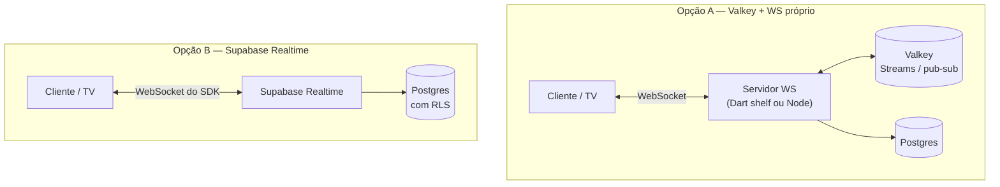

# ADR-002 — Supabase Realtime em vez de Valkey + WebSocket próprio

> **Status:** aceito · **Data:** 2026-08-07 · **Decisor:** Diogo
> **Relaciona:** [[ADR-004-rbac-na-rls]] (a RLS também vale no Realtime)

## Contexto

A Fase 2 prevê uma **TV no salão** mostrando a fila de pedidos em tempo real, alimentada por
pedidos que o cliente faz pelo QR da mesa. Isso exige empurrar mudanças do servidor para a tela
sem o usuário atualizar a página.

A ideia inicial era **Valkey** (fork do Redis) como fila chave-valor, com algum servidor
WebSocket na frente.

## Decisão

**Supabase Realtime** na Fase 2, com o acesso isolado atrás de uma interface
`OrderQueueService`.

### Por quê

1. **Quem mantém isso é a igreja.** A opção A exige um servidor rodando, com deploy,
   monitoramento, certificado e alguém para reiniciar quando cair às 19h de domingo. O Espaço
   Café não tem equipe de plantão. O Realtime é infraestrutura gerenciada que já vem no plano
   que o projeto usa.
2. **Zero código novo de autorização.** O Realtime respeita a RLS: a policy que já impede o
   `anon` de ver vendas ([[ADR-004-rbac-na-rls]]) vale igual no canal em tempo real. Com um WS
   próprio, seria preciso reimplementar o RBAC inteiro na camada de socket — e todo RBAC
   duplicado eventualmente diverge.
3. **O volume não justifica.** Valkey resolve throughput e latência de fila em escala. A fila
   aqui é de dezenas de pedidos por culto, não milhares por segundo. Adotar Valkey agora seria
   pagar complexidade por um problema que o Espaço Café não tem.
4. **Já está publicado.** As tabelas `pedido`, `pedido_item` e `alerta_estoque` foram
   adicionadas à publication `supabase_realtime` na migration de RLS. Não há trabalho pendente.

### A porta que fica aberta

O consumo do Realtime não é espalhado pelas telas: fica atrás de `OrderQueueService`. Se um dia
a fila justificar Valkey Streams, troca-se a implementação do service — nenhuma View muda.
É a mesma disciplina de [[ADR-001-mvvm-getx]] aplicada à infraestrutura.

## Consequências

**Positivas**
- Nenhum servidor próprio para a igreja manter.
- Autorização em tempo real herdada da RLS, sem código duplicado.
- Reconexão automática (importante: a igreja usa rede de celular).

**Negativas / riscos**
- Dependência de fornecedor: se o Supabase cair, a TV para. Aceitável — se ele cair, o PDV
  também para, então não é um ponto de falha *adicional*.
- Postgres Changes tem limite de conexões simultâneas por plano. Irrelevante aqui (uma TV e
  poucos caixas), mas é o número a observar se o sistema for para várias igrejas.

**A rever se**
- A fila passar de ~100 eventos/minuto sustentados, ou
- Surgir necessidade de processamento assíncrono real (retry com backoff, dead-letter queue) —
  aí Valkey Streams passa a ganhar de verdade.
