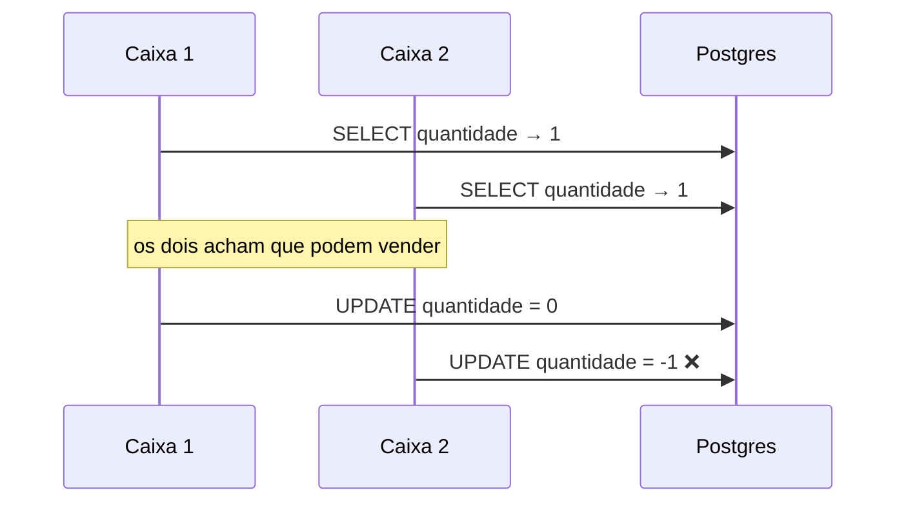

# ADR-003 — Venda por RPC transacional, não por inserts do cliente

> **Status:** aceito · **Data:** 2026-08-07 · **Decisor:** Diogo
> **Relaciona:** [[ADR-004-rbac-na-rls]] · [[ADR-001-mvvm-getx]]

## Contexto

Registrar uma venda envolve quatro escritas que precisam acontecer **juntas ou nenhuma**:

1. criar a linha em `venda`
2. criar N linhas em `venda_item`
3. decrementar `produto.quantidade` de cada item
4. gravar a movimentação em `movimentacao_estoque`

O caminho ingênuo é o Flutter fazer isso em sequência. E ele quebra em dois cenários reais do
Espaço Café:

**Cenário 1 — dois caixas, um bolo.** Dois voluntários, dois celulares, o mesmo último bolo de
cenoura. Ambos leem `quantidade = 1`, ambos decidem que dá para vender, ambos gravam.
Resultado: dois bolos vendidos, estoque `-1`, e um cliente sem bolo no balcão.



**Cenário 2 — rede da igreja.** O celular grava a `venda`, o 4G oscila, e os `venda_item` nunca
chegam. Fica uma venda fantasma de R$ 0,00 no relatório e o estoque sem baixa.

**Cenário 3 — preço vindo do cliente.** Se o app enviasse `preco_unitario`, qualquer pessoa com
o DevTools aberto registraria um café por R$ 0,01 — a `anon key` é pública
([[ADR-004-rbac-na-rls]]).

## Decisão

A venda entra por **uma única RPC transacional** no Postgres:

```sql
fn_registrar_venda(p_ministerio_id, p_tipo, p_itens jsonb, p_desconto, p_observacao)
```

Três garantias, todas do lado do servidor:

| Garantia | Como |
|---|---|
| **Atomicidade** | Tudo roda dentro da transação da função. Erro em qualquer item → rollback completo. |
| **Sem venda dupla** | `SELECT ... FOR UPDATE` na linha do produto serializa o acesso até o fim da transação. O segundo caixa espera, relê `0` e recebe `estoque_insuficiente`. |
| **Preço confiável** | `p_itens` leva **só** `produto_id` e `quantidade`. O preço é lido de `produto` dentro da função. |

E o fechamento: **não existe policy de `INSERT` na tabela `venda`**. Inserir direto do app não é
"desencorajado" — é impossível por construção.

### Erros que o voluntário consegue ler

As exceções saem em formato `chave: detalhe`:

```
estoque_insuficiente: Brownie (disponivel: 0, pedido: 2)
```

O `SupabaseService` traduz isso para português na tela. O voluntário lê *qual* produto faltou e
*quanto* tinha — não um código do Postgres.

## Alternativas consideradas

| Alternativa | Por que não |
|---|---|
| Inserts sequenciais no Flutter | Os três cenários acima. |
| Transação otimista com `version` | Exigiria retry no cliente e ainda deixaria o preço no request. |
| Edge Function em TypeScript | Mais uma linguagem e um deploy para a igreja manter, para fazer o que o Postgres já faz nativamente. |

## Consequências

**Positivas**
- Estoque negativo é impossível — há inclusive uma `CHECK (quantidade >= 0)` como última trava.
- Venda parcial não existe.
- O `FakeVendaRepository` do teste espelha esse contrato (valida todos os itens antes de gravar
  qualquer um), então o teste cobre o comportamento real, não uma simplificação.

**Negativas / riscos**
- Regra de negócio em PL/pgSQL: menos gente sabe mexer, e a migration precisa ser versionada com
  disciplina.
- `SECURITY DEFINER` ignora RLS, então a checagem de ministério é **explícita** dentro da função.
  Se alguém adicionar uma RPC nova e esquecer essa checagem, abre um furo. Registrado aqui como
  o principal ponto de atenção em revisão de código.

**A rever se**
- Surgir a necessidade de venda offline (o voluntário registra sem rede e sincroniza depois).
  Aí o modelo transacional síncrono não basta e vira um problema de CRDT/fila local.
