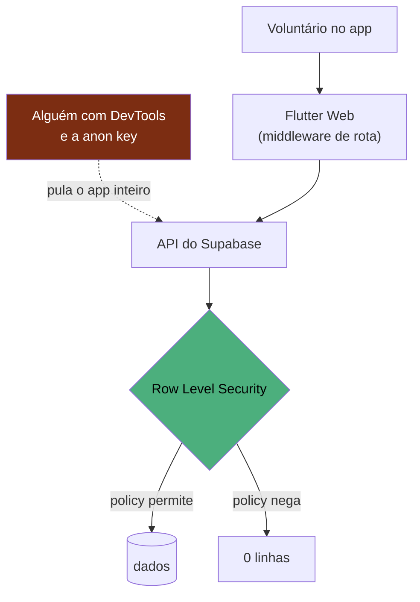

# ADR-004 — RBAC na RLS, não na UI

> **Status:** aceito · **Data:** 2026-08-07 · **Decisor:** Diogo
> **Relaciona:** [[ADR-003-rpc-transacional]] · [[ADR-002-realtime-vs-valkey]]

## Contexto

O sistema tem quatro papéis com acessos bem diferentes:

| Papel | Entra como | Deve enxergar |
|---|---|---|
| `admin` | e-mail + senha | tudo, todos os ministérios |
| `caixa` | e-mail + senha | **só o próprio ministério** |
| **TV** | token na URL, sem login | fila de pedidos — **nunca** valores nem vendas |
| **cliente** | anônimo, via QR de mesa | cardápio e o próprio pedido |

O fato que decide tudo: **isto é Flutter Web**. O bundle é baixado pelo navegador e a
`anon key` do Supabase vai dentro dele. Qualquer pessoa abre o DevTools, copia a chave e chama
a API REST direto — sem passar por nenhuma tela do app.



Um `if (usuario.isAdmin)` no Dart não é controle de acesso. É decoração de interface.

## Decisão

**A autorização mora nas policies de RLS do Postgres.** O `RbacMiddleware` do GetX existe apenas
para o voluntário não ver um item de menu que ele nunca conseguiria usar.

### Como as policies expressam cada papel

Três funções `SECURITY DEFINER` resolvem o papel do usuário atual e são usadas em toda policy:
`fn_e_admin()`, `fn_ministerio_atual()`, `fn_papel_atual()`.

```sql
create policy produto_select on public.produto
  for select to authenticated
  using (public.fn_e_admin() or ministerio_id = public.fn_ministerio_atual());
```

Decisões pontuais que valem registrar:

- **`venda` não tem policy de UPDATE nem DELETE.** Ninguém apaga venda, nem o admin pelo app.
  Caixa errado se corrige com estorno, não apagando histórico.
- **`perfil_usuario` só o admin escreve.** Sem isso, um caixa se promoveria a admin com um
  `UPDATE` na própria linha.
- **O cardápio público é uma view `security_invoker = false`.** Se fosse `true`, o `anon`
  precisaria de policy de SELECT em `produto` — e leria também `custo` e `quantidade`, expondo a
  margem do café e o estoque. Com `definer`, a view é a única janela do público e projeta apenas
  nome, descrição, preço e disponibilidade.
- **A TV é `anon` com filtro temporal.** Lê `pedido` com status em fila e criado nas últimas 12
  horas. A tabela `pedido` não tem coluna de valor, e `venda` continua inacessível.
- **Perfil novo nasce `ativo = false`.** Autenticar no Supabase não basta para entrar no sistema
  da igreja; um admin precisa liberar. Cadastro aberto sem isso seria porta destrancada.

### Onde a RLS não alcança

`SECURITY DEFINER` ignora RLS por definição. Então `fn_registrar_venda` e
`fn_movimentar_estoque` fazem a checagem de ministério **explicitamente**, na primeira linha:

```sql
if not public.fn_e_admin()
   and public.fn_ministerio_atual() is distinct from p_ministerio_id then
  raise exception 'sem_permissao_neste_ministerio' using errcode = '42501';
end if;
```

**Regra de revisão:** toda RPC nova com `SECURITY DEFINER` precisa dessa checagem. É o único
lugar do sistema onde esquecer uma linha abre um furo de verdade.

## Consequências

**Positivas**
- Segurança não depende do cliente. Trocar o Flutter por outra coisa não reabre nada.
- O Realtime herda a mesma autorização de graça ([[ADR-002-realtime-vs-valkey]]).
- O teste negativo é simples e conclusivo: entrar como `anon` e contar linhas em `venda` —
  esperado zero (procedimento em `SUPABASE.md`).

**Negativas / riscos**
- Policy tem custo por linha; queries grandes ficam mais lentas. Irrelevante nesta escala.
- Depurar "sumiu a linha" é menos óbvio: pode ser filtro *ou* policy. Mitigado pelo
  `SupabaseService`, que traduz `42501`/`PGRST301` em "Você não tem permissão para esta ação".
- Duas fontes de verdade sobre papéis (policies + `RbacMiddleware`). Aceito conscientemente: a
  segunda é UX, não segurança, e está documentada como tal no próprio arquivo.
