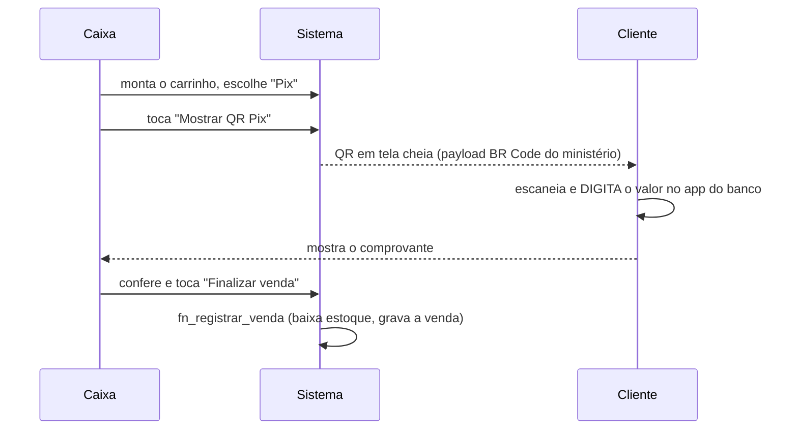

# ADR-005 — Pix sem confirmação automática de pagamento

> **Status:** aceito · **Data:** 2026-08-07 · **Decisor:** Diogo
> **Relaciona:** [[ADR-003-rpc-transacional]]

## Contexto

O Espaço Café precisa receber por Pix. A pergunta é **quanto** o sistema participa disso.

Confirmação automática ("o sistema sabe que o cliente pagou") exige:

1. conta em um **PSP** (Mercado Pago, Asaas, Gerencianet, Efí...) ou integração direta com o
   banco via API Pix;
2. **CNPJ** e processo de credenciamento — a igreja é uma associação, o cadastro não é imediato;
3. um **endpoint público** para receber o webhook do PSP, com validação de assinatura;
4. cobrança dinâmica (um `txid` por venda) em vez de um QR fixo;
5. tratamento de estorno, pagamento parcial e duplicado.

Nada disso é código difícil. É **processo administrativo e infraestrutura** que o Espaço Café
não tem hoje — e que travaria a entrega de um sistema cujo problema real é outro: a igreja não
sabe o que vendeu nem quando o café vai acabar.

## Decisão

**Fase 1: QR Pix estático por ministério, com conferência manual pelo caixa.**

O ministério cadastra o **payload copia-e-cola (BR Code)**, e o app renderiza o QR com
`qr_flutter`. Alternativa para quem só tem a foto: upload da imagem no Storage.

### O que o sistema promete — e o que não promete

O diálogo do QR diz, na tela, em amarelo:

> *Confira o comprovante do cliente antes de finalizar. O sistema não confirma o pagamento
> automaticamente.*

Isso é deliberado. Um sistema que **parece** confirmar pagamento e não confirma é pior que um
que assume a limitação: o voluntário confiaria numa garantia que não existe e o café perderia
dinheiro sem ninguém notar.

Coerente com isso, **`TipoVenda.pix` só aparece como opção se o ministério tiver QR cadastrado.**
Sem QR, o padrão vira dinheiro — não faz sentido oferecer um meio de cobrança que o caixa não
consegue executar.

## Consequências

**Positivas**
- Entrega hoje, sem depender de CNPJ, credenciamento ou servidor público.
- Zero custo de PSP (que cobra por transação — relevante num café de igreja com ticket de R$ 6).
- Multi-ministério de graça: cada um cadastra a própria chave, o dinheiro cai na conta certa.

**Negativas / riscos**
- **O cliente digita o valor.** Pode digitar errado (a menos ou a mais). Mitigação parcial: o
  valor aparece grande no diálogo, acima do QR.
- **Conferência humana.** Um voluntário distraído pode finalizar sem olhar o comprovante. É o
  mesmo risco que já existe hoje sem sistema nenhum — não pioramos nada, apenas não resolvemos.
- O relatório mostra **vendas registradas**, não **dinheiro confirmado em conta**. Documentado
  para o tesoureiro não confundir os dois números.

**A rever quando**
- A igreja tiver CNPJ com conta PJ e conseguir credenciar um PSP; ou
- O volume justificar a taxa por transação.

O caminho de migração já está preparado: a venda nasce com `tipo = 'pix'` e id próprio, então
adicionar `txid` e um status de pagamento é uma migration aditiva — nenhuma reescrita.
