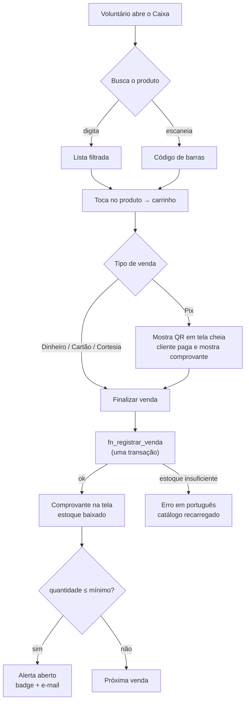

# PRD — Sistema do Espaço Café (PAES Lagoa)

> **Cliente:** Igreja Anglicana PAES Lagoa — Recife/PE
> **Status:** Fase 1 implementada · **Data:** 2026-08-07
> ADRs relacionados: [[ADR-001-mvvm-getx]] · [[ADR-002-realtime-vs-valkey]] ·
> [[ADR-003-rpc-transacional]] · [[ADR-004-rbac-na-rls]] · [[ADR-005-pix-sem-webhook]]

## 1. O problema

O **Espaço Café** funciona nos cultos da PAES Lagoa e opera **sem nenhum sistema**. Não há
registro de venda, controle de estoque, cadastro de produto, nem aviso de que um item está
acabando.

Consequências concretas:

| Sintoma | Efeito |
|---|---|
| Produto acaba no meio do culto | Cliente sem atendimento; venda perdida |
| Nenhum registro de venda | A igreja não sabe quanto o café arrecada |
| Reposição por intuição | Compra a mais (desperdício) ou a menos (ruptura) |
| Caixa conferido de cabeça | Divergência sem rastro no fim do turno |

**O gatilho do projeto:** descobrir que o café acabou **antes** do culto, não durante.

## 2. Quem usa

| Perfil | Contexto | O que precisa |
|---|---|---|
| **Voluntário do caixa** | Em pé, **no celular**, com fila na frente e pressa | Registrar a venda em poucos toques, sem errar |
| **Responsável pelo ministério** | Antes/depois do culto | Saber o que repor e quanto entrou |
| **Tesoureiro da igreja** | Fechamento mensal | Total por período, exportável para planilha |
| **Administrador** | Eventual | Cadastrar ministérios, liberar voluntários |

> O voluntário no celular é o usuário-alvo. Toda decisão de UI parte dele: alvo de toque ≥48dp,
> uma coluna, tema escuro (o salão tem luz baixa), erro em português sem jargão.

## 3. Escopo

### Fase 1 — implementada

| # | Requisito | Como foi resolvido |
|---|---|---|
| **R1** | Cadastro de produtos por ministério | CRUD com preço, custo, unidade, código de barras e estoque mínimo |
| **R2** | Registro de venda | PDV com busca/scanner, carrinho e finalização transacional |
| **R3** | Número, tipo e valor da venda | `tipo`: Pix · Dinheiro · Cartão · Cortesia |
| **R4** | Baixa automática de estoque | Dentro da mesma transação da venda ([[ADR-003-rpc-transacional]]) |
| **R5** | Aviso de produto acabando | Trigger no Postgres → tela de Alertas com badge **+ e-mail** ao responsável |
| **R6** | Relatórios por **dia / semana / mês** | Agregação em funções SQL + gráficos + export CSV |
| **R7** | QR Code do ministério | **Três usos:** (a) Pix de recebimento, (b) QR de mesa, (c) leitura de código de barras |
| **R8** | RBAC | admin · caixa (por ministério) · TV · cliente — na RLS ([[ADR-004-rbac-na-rls]]) |
| **R9** | Multi-ministério | Isolamento por `ministerio_id` em todo o schema |
| **R10** | Responsivo mobile → TV | 4 breakpoints: mobile <768 · tablet 768 · desktop 1280 · TV 1920 |

### Fase 2 — schema e rotas prontos, telas pendentes

- **R11** — TV do salão com fila de pedidos em tempo real (Supabase Realtime).
- **R12** — Cliente faz pedido escaneando o QR da mesa.
- **R13** — Integração com o app de pedidos externo.

### Fora de escopo (decidido, não esquecido)

- **Confirmação automática de pagamento Pix** — exige PSP e CNPJ ([[ADR-005-pix-sem-webhook]]).
- **Emissão fiscal** — o café não emite nota.
- **Venda offline** — exigiria fila local e resolução de conflito; a rede da igreja atende hoje.
- **App nativo** — Flutter Web instalável como PWA cobre o caso.

## 4. Regras de negócio

1. **Venda não se apaga.** Erro do caixa se corrige com estorno. Sem policy de UPDATE/DELETE.
2. **Estoque nunca fica negativo.** Garantido por `FOR UPDATE` na RPC + `CHECK` na tabela.
3. **Cortesia baixa estoque mas não conta como arrecadação.** É o café oferecido ao visitante:
   o estoque precisa bater, a receita não deve inflar.
4. **Produto se desativa, não se apaga.** Apagar levaria o histórico de vendas junto.
5. **Toda mudança de quantidade deixa rastro** em `movimentacao_estoque` (entrada, venda,
   ajuste, perda), com saldo posterior — auditável sem recalcular a série.
6. **No máximo um alerta aberto por produto.** Sem isso, um culto que zera cinco itens geraria
   dezenas de e-mails e o responsável pararia de ler.
7. **Usuário novo nasce inativo.** Autenticar não é ser autorizado; um admin libera.
8. **Fuso `America/Recife` nos relatórios.** A venda das 21h de domingo fecha no domingo da
   igreja, não no dia UTC seguinte.

## 5. Fluxo principal — venda no caixa

## 6. Métricas de sucesso

| Métrica | Como medir | Alvo |
|---|---|---|
| Vendas registradas por culto | `fn_resumo_periodo` | > 90% das vendas reais |
| Rupturas de estoque durante o culto | Alertas que viraram "esgotado" | Tendência de queda mês a mês |
| Tempo por venda | Observação em campo | < 20s do primeiro toque ao comprovante |
| Adoção | Cultos com ao menos uma venda registrada | 100% após 1 mês |

## 7. Riscos e mitigações

| Risco | Impacto | Mitigação |
|---|---|---|
| Voluntário não adota o sistema | Alto — sem dado, nada funciona | UI de poucos toques; treinamento com o próprio seed de teste |
| Rede da igreja cai no culto | Alto | *Não mitigado na F1.* Venda offline está fora de escopo — **registrado como principal limitação conhecida** |
| Cliente digita valor errado no Pix | Médio | Valor em destaque acima do QR; conferência do comprovante |
| E-mail de alerta cai em spam | Médio | Alerta in-app funciona independente do e-mail |
| Câmera do scanner não abre | Baixo | Exige HTTPS; a tela sempre oferece digitação manual |
| Ninguém cadastra o e-mail do responsável | Médio | Badge "Sem e-mail de alerta" no card do ministério |

## 8. Definição de pronto (Fase 1)

- [x] `fvm flutter analyze` sem issues
- [x] `fvm flutter test` — 40 testes passando
- [x] `flutter build web --release` e `--wasm` compilando
- [ ] Migrations aplicadas no Supabase de produção
- [ ] Usuários reais criados e liberados
- [ ] E-mail do responsável cadastrado e Edge Function com deploy
- [ ] Produtos reais do Espaço Café cadastrados (substituindo o seed)
- [ ] Teste de RLS executado (`SUPABASE.md`, seção 6)
- [ ] Validação de responsividade nos 4 breakpoints
