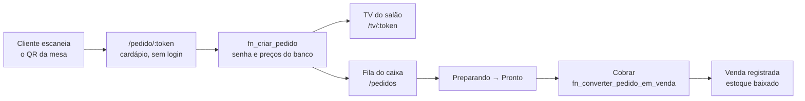

# Espaço Café — PAES Lagoa

Sistema de **vendas, estoque e pedidos** do Espaço Café da Igreja Anglicana PAES Lagoa (Recife/PE).

Antes disso o café operava sem nada: nenhum registro de venda, nenhum controle de estoque e
nenhum aviso de que um produto estava acabando.

**Flutter Web**, mobile-first (o voluntário opera no celular durante o culto), responsivo até a
TV do salão. Backend em **Supabase** — sem servidor próprio para a igreja manter.

## Rodar

```bash
fvm flutter pub get

cp env.example.json env.json      # preencher com as chaves do Supabase
fvm flutter run -d chrome --dart-define-from-file=env.json
```

> `env.json` é gitignored. Setup do backend: **[SUPABASE.md](SUPABASE.md)**.
> Sem as chaves, o app abre numa tela explicando o que falta em vez de quebrar.

### Verificação

```bash
fvm flutter analyze          # sem issues
fvm flutter test             # 53 testes, sem rede
fvm flutter build web --release
fvm flutter build web --release --wasm    # ver ADR-006
```

### Rota de desenvolvimento

`/showcase` (só com `APP_ENV=dev`) renderiza todo o design system. Redimensione a janela para
validar os 4 breakpoints de uma vez.

## O que o sistema faz

| Módulo | O que resolve |
|---|---|
| **Caixa (PDV)** | Venda em poucos toques: busca ou scanner → carrinho → tipo → finaliza. QR Pix em tela cheia. |
| **Estoque** | Produtos, entrada/ajuste/perda com histórico auditável, código de barras. |
| **Alertas** | Produto no mínimo → badge no menu **+ e-mail** ao responsável. |
| **Relatórios** | Dia / semana / mês, gráficos por dia e por tipo de venda, export CSV. |
| **Ministérios** | Multi-ministério: cada um com seu Pix, produtos, caixa e relatórios. QR de mesa. |
| **Pedidos (caixa)** | Fila do salão: avançar status e cobrar (a cobrança é o que baixa o estoque). |
| **Pedido (cliente)** | `/pedido/:token` — cardápio pelo QR da mesa, sem login, com acompanhamento da senha. |
| **TV** | `/tv/:token` — telão do salão com a fila em tempo real, sem login e sem valores. |

## Arquitetura

**MVVM + GetX.** A regra de negócio crítica mora no Postgres, não no Dart.

```
View (Widget) → ViewModel (GetxController) → Repository (contrato) → Service → Supabase
```

```
lib/
├── core/        theme · widgets · utils · routes · config
├── data/        models · services · repositories
└── modules/     auth · pdv · estoque · ministerios · relatorios
                 pedido (cliente) · pedidos (caixa) · tv · showcase
```

Regras completas e invioláveis em **[CLAUDE.md](CLAUDE.md)**. As três que mais importam:

1. View nunca chama `Supabase.instance` — só ViewModel → Repository.
2. ViewModel nunca importa `supabase_flutter` — só o contrato abstrato.
3. `Color(0xFF…)` inline é proibido — só tokens de `core/theme/`.

### Responsividade

| Breakpoint | Largura | Uso |
|---|---|---|
| `mobile` | < 768 | **alvo principal** — voluntário no celular |
| `tablet` | 768–1279 | caixa em tablet, catálogo + carrinho lado a lado |
| `desktop` | 1280–1919 | painel do admin, relatórios |
| `tv` | ≥ 1920 | fila de pedidos, tipografia ~1.8× |

Nenhuma tela lê `MediaQuery` direto — só `context.breakpoint`, `ResponsiveValue` e
`ResponsiveBody`.

## Decisões (ADR)

| ADR | Decisão |
|---|---|
| [001](ADR/ADR-001-mvvm-getx.md) | MVVM + GetX, sem `usecases` |
| [002](ADR/ADR-002-realtime-vs-valkey.md) | Supabase Realtime em vez de Valkey + WebSocket próprio |
| [003](ADR/ADR-003-rpc-transacional.md) | Venda por RPC transacional — impede venda dupla do último item |
| [004](ADR/ADR-004-rbac-na-rls.md) | RBAC na RLS do Postgres; a UI só esconde rota |
| [005](ADR/ADR-005-pix-sem-webhook.md) | QR Pix estático, sem confirmação automática |
| [006](ADR/ADR-006-shared-preferences-wasm.md) | `shared_preferences` para não bloquear o build wasm |

Requisitos: **[PRD/PRD-espaco-cafe.md](PRD/PRD-espaco-cafe.md)**

## Limitações conhecidas

- **Sem venda offline.** Se a rede cair no meio do culto, não dá para registrar. É a principal
  limitação da Fase 1 e está registrada no PRD.
- **Pix não é confirmado automaticamente.** O QR é estático, o cliente digita o valor e o caixa
  confere o comprovante ([ADR-005](ADR/ADR-005-pix-sem-webhook.md)).
- **Scanner de código de barras exige HTTPS.** É o navegador que exige, não o app. A tela sempre
  oferece digitação manual como alternativa.
- **Relatório mostra vendas registradas, não dinheiro confirmado em conta.**

## Fluxo de pedidos (Fase 2)



**O pedido não baixa estoque; a cobrança baixa.** Um pedido abandonado no salão não pode
segurar estoque que nunca foi vendido.

## Segurança

- Nenhuma chave no código — só `--dart-define-from-file=env.json` (gitignored).
- A `anon key` é pública por natureza: vai no bundle e qualquer um lê no navegador. Por isso a
  autorização mora na **RLS** ([ADR-004](ADR/ADR-004-rbac-na-rls.md)).
- Usuário novo nasce **inativo**: autenticar não é ser autorizado.
- **Rotas públicas** (`/tv/:token`, `/pedido/:token`) não têm middleware de propósito: quem
  protege são as RPCs `SECURITY DEFINER`, que só devolvem o que o token autoriza. A TV nunca
  recebe valor monetário.
- Teste negativo de RLS em [SUPABASE.md](SUPABASE.md), seção 6.
